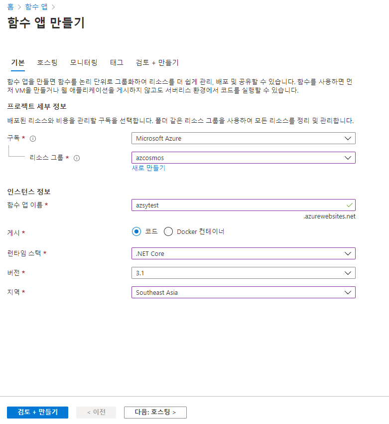
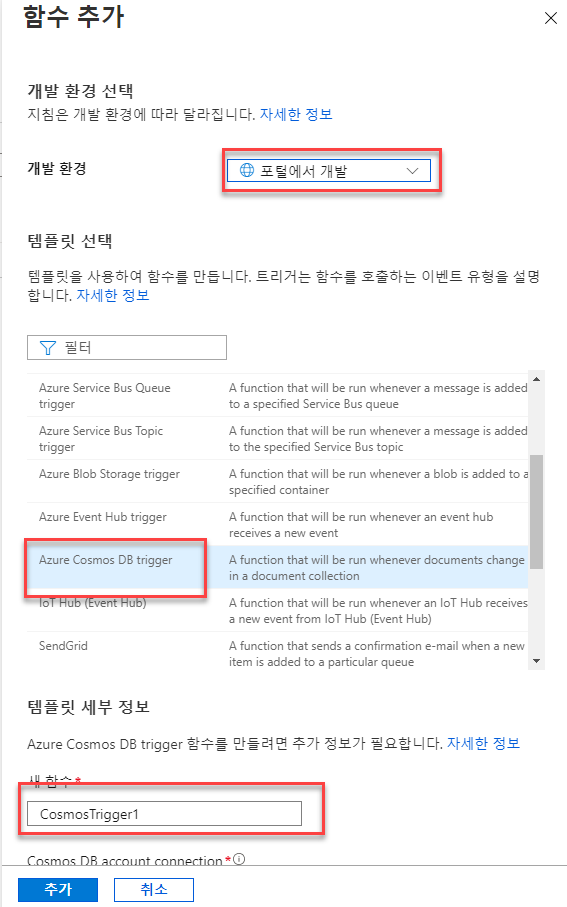
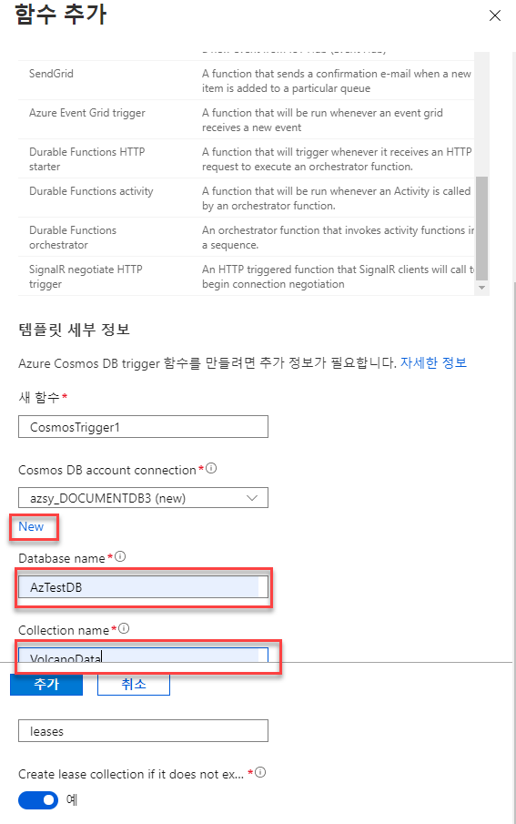
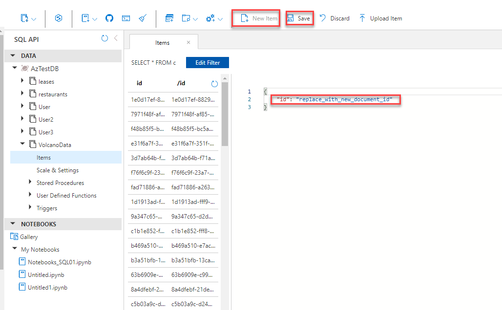
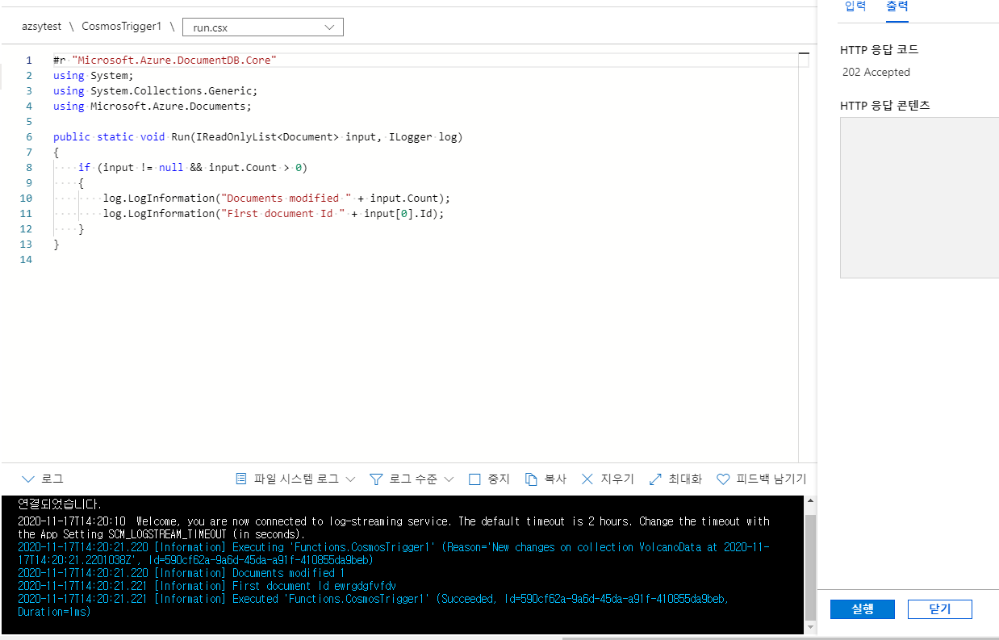

### CosmosDB는 다양한 리소스와의 데이터의 흐름을 연동할 수 있습니다  
  

### Azure Portal에서 Azure Functions를 생성합니다  
  


``` azure
# 기본
함수 앱 이름 : 고유한 이름  
게시 : 코드  
런타임 스택 : .Net Core
버전 : 3.1
지역 : Southeast Asia

# 호스팅
운영체제 : Windows  
플랜 유형 : 사용량(서버리스)  


# 모니터링
Application Insights 사용 : 아니오  
```

### Azure CosmosDB에서 Azure Functions를 추가 합니다  
   

``` azure
개발환경 : 포털에서 개발
트리거 템플릿 : Azure Cosmos DB Trigger
새 함수 : 함수명

Cosmos DB account connection (new 클릭)
Database name : 데이터베이스명
Collection name : 컬렉션명
```

### 데이터 저장 후 테스트를 진행 합니다
만들어진 함수에서 코드+테스트 항목으로 진입, 테스트/실행 버튼 클릭 후 실행  
CosmosDB에서 새로운 아이템 등록/저장 후 정상적으로 콘솔에서 출력 되는지 확인  

  
  