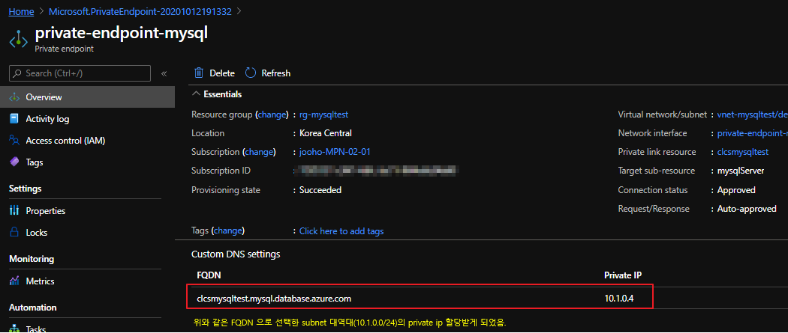

## ADSHandsOn Azure Database for MySQL
준비사항
- [Mysqlworkbench download](https://dev.mysql.com/downloads/workbench/)
  - [visual C++ redistributable for visual studio download](https://support.microsoft.com/ko-kr/help/2977003/the-latest-supported-visual-c-downloads)
  
기존 환경 마이그레이션 혹은 신규 서비스 구축 시 진행해야 할 기본 구축 가이드 및 일부 기능들을 HandsOn 합니다  

## 목차

1. [Azure Database for MySQL 생성](#01)
2. [Azure Database for MySQL Architecture & HA(High Availability)](#02)
- 2-1. [Architecture](#02-01)
- 2-2. [HA(High Availability)](#02-02)
3. [방화벽 설정 및 기존 네트워크와 Service Endpoint 연결](#03)
- 3-1. [client ip 방화벽 설정 추가](#03-01)
- 3-2. [VNET](#03-02)
- 3-3. [Private Link](#03-03)
4. [MySQL 접속 확인](#04)
- 4-1. [client tool등을 활용하여 mysql 접속 테스트](#04-01)
5. [Time Zone 변경](#05)
6. [환경 변수 변경](#06)
7. [특정 시점 복원](#07)
8. [복원된 서버로 접속](#08)
9. [Slow Query 모니터링](#09)
10. [Geo-Replication](#10)
11. [Azure Database for Mysql 제약사항](#11)
12. [Single Server vs Flexible Server](#12)


### 01. Azure Database for MySQL 생성<a name="01"></a>

[Azure Portal] - [mysql을 검색 후 New 버튼을 클릭]


위와같이 입력 후 생성합니다.

### 02. Azure Database for MySQL Architecture & HA(High Availability)<a name="02"></a>

#### 02-01. Architecture<a name="02-01"></a>


Azure Mysql은 크게 3가지로 구성.
- Gateway : proxy역할을하며 client 연결을 db server로 라우팅.
- Computing node : mysql server
- Storage : 모든 물리적파일, 로그파일등이 저장되는 remote storage

#### 02-02. HA(High Availability)<a name="02-02"></a>


Computing node error & Storage error

Azure docs : https://docs.microsoft.com/ko-kr/azure/mysql/concepts-high-availability


### 03. 방화벽 설정 및 기존 네트워크와 Service Endpoint 연결<a name="03"></a>

#### 03-01. client ip 방화벽 설정 추가<a name="03-01"></a>


#### 03-02. VNET<a name="03-02"></a>
docs : https://docs.microsoft.com/ko-kr/azure/mysql/concepts-data-access-and-security-vnet

Azure Database for MySQL에 대한 접속은 기본적으로는 DNS 통신을 하며 방화벽으로 핸들링 됩니다  
기존 서비스와는 service endpoint를 통하여 서브넷간의 통신을 할 수 있고, Public ip로 통신도 가능 합니다  


Service Endpoint Enabled (Vnet-subnet 가동 중지 시간 발생) : https://docs.microsoft.com/ko-kr/azure/virtual-network/virtual-network-service-endpoints-overview#considerations

VNET service Endpoint : https://docs.microsoft.com/ko-kr/azure/virtual-network/virtual-network-service-endpoints-overview

#### 03-03. Private Link<a name="03-03"></a>
docs : https://docs.microsoft.com/ko-kr/azure/mysql/concepts-data-access-security-private-link




  


### 04. MySQL 접속 확인<a name="04"></a>
생성된 mysql에 접속하기 위해 관련 방화벽 설정을 한 뒤에 설치된 MySQL Workbench와 같은 client tool을 통하여 MySQL Server에 접속 합니다.

#### 04-01. client tool등을 활용하여 mysql 접속 테스트<a name="04-01"></a>


- Hostname : {mySQLName}.mysql.database.azure.com ex) clcsmysqltest.mysql.database.azure.com
- Port : 3306
- Username : {userName@mySQLName} ex) clooadmin@clcsmysqltest


### 05. Time zone 변경<a name="05"></a>
Azure Database for MySQL은 PaaS 서비스이기 때문에 로컬 서버의 시간을 변경할 수 없습니다  
대신 timezone 변경으로 그와 동일하게 작업할 수 있습니다  
MySQL Workbench를 통하여 하단 sql 스크립트를 실행 합니다  

```sql
SELECT NOW();

SET SQL_SAFE_UPDATES=0;
CALL mysql.az_load_timezone();
SET SQL_SAFE_UPDATES=1;

# 변경 할 time zone 조회
SELECT name 
FROM mysql.time_zone_name;

# session의 time zone 설정 
SET time_zone = 'Asia/Seoul';
SELECT NOW();

# mysql 재기동 이후에도 동일한 time_zone 설정을 원한다면 portal에서 설정해야 한다.
```


### 06. 환경 변수 변경<a name="06"></a>
위에서 작업된 timezone 변경은 세션 수준이며 만일 MySQL Server가 재시작 된다면 다시 원래의 UTC로 돌아가게 됩니다  
이를 방지하기 위해서는 기존 On-prem 환경에서는 my.cnf에서 time_zone parameter 추가로 해결할 수 있지만 PaaS에서는 서버 매개 변수를 변경해야 합니다  

변경 불가능한 환경 변수도 있으며 이는 고정된 값으로 구성되어 있습니다 [서버매개변수 참고 docs](https://docs.microsoft.com/ko-kr/azure/mysql/concepts-server-parameters)
- 버퍼풀 관련 (서버의 SKU에 의해 결정 됩니다) [가격책정계층](https://docs.microsoft.com/ko-kr/azure/mysql/concepts-pricing-tiers) 
- innodb_flush_log_at_trx_commit : 1
- sync_binlog : 1
- innodb_log_file_size : 256MB
- innodb_log_files_in_group : 2

일반적인 환경에서 필수로 변경해야 하는 환경 변수는 다음과 같습니다  
- timezone 
- character_set_server
- collation_server

아래와 같이 Azure Portal을 통해 configuration을 변경할 수 있습니다.


아래 Azure CLI 코드를 사용하여서도 간단하게 서버 레벨의 환경 변수를 변경 합니다

```powershell

# 타임존 변경
az mysql server configuration set --name time_zone --resource-group $resourceGroup --server $mySQLName --value "Asia/Seoul"
# character_set_server 변경
az mysql server configuration set --name character_set_server --resource-group $resourceGroup --server $mySQLName --value "UTF8MB4"
# collation_server 변경
az mysql server configuration set --name collation_server --resource-group $resourceGroup --server $mySQLName --value "utf8mb4_unicode_ci"

```

### 07. 특정 시점 복원<a name="07"></a>
Azure Database for MySQL에서는 다양한 방식 (Azure Portal, Azure CLI, Azure Powershell 등)으로 손쉽게 특정 시점으로 복원할 수 있습니다  
샘플 데이터베이스를 생성 후 특정 테이블을 실수로 삭제 한 뒤 삭제 이전 시점으로 복원하는 테스트를 진행 합니다  

MySQL Workbench를 실행한 후 [샘플 데이터베이스](/AzureDatabaseforMySQL/mysqlsampledatabase.sql) 를 전체 실행합니다  

이후 테이블을 삭제하고 삭제된 시간을 따로 기록해 둡니다

```sql
SELECT UTC_TIMESTAMP();

DROP TABLE classicmodels.payments;
```

#### Portal에서 실행
생성된 Azure Database for MySQL에서 개요에서 복원을 선택 합니다


복원 시점 항목에서 DROP TABLE 작업한 시점을 입력 합니다  
새 서버명을 입력 후 확인 버튼을 클릭 합니다  


#### CLI 로 실행

```powershell
$newServerName="newservername"
$restorePoint="*2020-05-13T13:59:00Z"

az mysql server restore --resource-group $resourceGroup --name $newServerName --restore-point-in-time $restorePoint --source-server $mySQLName
```


#### 08. 복원된 서버로 접속<a name="08"></a>
새로 복원된 서버는 방화벽의 정보는 가져오지만 설정한 Vnet 규칙은 가져오지 않습니다  
기존과 동일하게 신규 서버에 대한 Vnet Rule을 추가 합니다  

```powershell
$ruleName="allow-azsn"

# mysql rule 추가
az mysql server vnet-rule create -n $ruleName -g $resourceGroup -s $newServerName --vnet-name $vnetName --subnet $subnetName
```

접속 후 삭제 된 classicmodels.customers 테이블이 존재 하는지 확인 합니다  

이렇게 복원된 DB로 각 Application이 접속할 수 있도록 Application에서 MySQL Endpoint들을 모두 변경해주거나  
mysqldump 등 도구를 통해서 Restore된 신규 MySQL에서 Data를 Export, 기존 MySQL에 Import할 수 있습니다  

cmd console에서 MySQL 설치 경로로 이동 후 다음과 같은 명령어로 복구할 수 있습니다  

```console
.\mysqldump.exe -p{password} --user={user} --host={restore mysql host} --protocol=tcp --port=3306 --skip-column-statistics "classicmodels" "payments" > c:\payments.sql

.\mysql.exe -p{password} --user={user} --host={main mysql host} --port=3306 --protocol=tcp --default-character-set=utf8 --comments --database=classicmodels  < c:\payments.sql
```

### 09. Slow Query 모니터링<a name="09"></a>
Azure Portal에서 생성된 MySQL을 찾아 왼쪽 항목에서 서버로그 탭을 선택 합니다  
상단에 매개 변수 편집을 클릭 합니다  


아래 항목 수정 후 저장 버튼을 클릭 합니다  
- log_output : file
- long_query_time : 1
- slw_query_log : ON


이제 MySQL Workbench에서 5초 이상 걸리는 쿼리를 사용 합니다  

```sql
SELECT /*+ MAX_EXECUTION_TIME(5000) */ 1 
FROM classicmodels.customers WHERE SLEEP(5);
```

Azure Portal에서 생성된 서버 로그를 확인 합니다  


### 10. Geo-Replication<a name="10"></a>
Azure Database for MySQL은 읽기 복제를 지원 합니다  
읽기 전용 복제본은 마스터 노드와 동일 지역에 생성할 수도 있으며 다른 데이터센터에 생성할 수도 있습니다  
아래 표는 지역마다 가용한 복제 지역을 나타냅니다  
  

아래처럼 portal을 통해 replication 설정을 간편하게 구성할 수 있고,


CLI를 실행하여 기존 MySQL서버에 읽기 전용 복제본을 해당 지역(script에서는 일본동부)에 생성 할 수 있습니다  

```powershell
$repServerName="repservername"
$repLocation="japaneast"

az mysql server replica create -n $repServerName -g $resourceGroup -s $mySQLName -l $repLocation
```

### 11. Azure Database for Mysql 제약사항.<a name="11"></a>

mysql이 지원하는 많은 storage engine 중 지원하는 engine은 아래 2가지 engine만 지원하고 MyISAM등의 엔진은 지원하지 않음.
- InnoDB
- MEMORY

이외의 제약사항은 아래 docs 참조

docs : https://docs.microsoft.com/ko-kr/azure/mysql/concepts-limits

### 12. Single Server vs Flexible Server.<a name="12"></a>

[Comparing the Mysql deployment options](https://docs.microsoft.com/en-us/azure/mysql/select-right-deployment-type#comparing-the-mysql-deployment-options-in-azure)

|attribute|Single Server|Flexible Server|
|------|---|---|
|Mysql Version Support|5.6,5.7,8.0|5.7|
|Network Connectivity|Public endpoints with server firewall <br>private access with Private Link support |Public endpoints with server firewall <br>Private access with Virtual Network integration|
|Operating system patching|Automatic|Automatic with custom maintenance window control|
|MySQL patching|Automatic|Automatic with custom maintenance window control|
|Service-level agreement(SLA)|99.99% availability SLA|No SLA in preview|
|Zone redundancy|Not supported|Supported|


### To-Be 
1. Query Performance Insight
2. Audit log
3. Monitoring
4. replication 구성 (onprem to azure)
